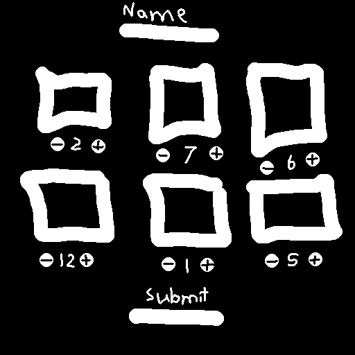

# Adam's AS 91896 Python Project

This is my Python project for AS 91896. The task was to create a GUI for Julie to use to store and edit orders for her party hire store.

## Usage

1. Download the repository by clicking Code > Download zip.
2. Unzip the downloaded zip file.
3. Run the launcher.bat file.

## Testing

Inputs | What I will input | What I expect to see | (After programming:) What I got |
-|-|-|-|
Expected | 123 chairs are requested when there are 125 in stock | Works, with no errors and adds an entry for 123 chairs. | Works, with no errors and adds an entry for 123 chairs. |
Expected | Receipt ID is set to 1234 | Works, with no errors and adds an entry with an ID of 1234. | Works, with no errors and adds an entry with an ID of 1234. |
Expected | I will navigate to the orders page and click to delete an order. | Order should be deleted, with no errors. | Confirmation box pops up and after clicking yes, the order is deleted with no errors. |
Boundary | Name is just a space | Works, with no errors and adds an entry, because it would be a pain to add. | Works, with no errors and adds an entry. |
Boundary | Receipt ID is left blank | Ask the user to enter a receipt ID. | Popup appears asking user to enter a receipt ID. |
Boundary | All items values are 0 | Ask user to add items. | Popup appears asking user to add valid amount of items. |
Invalid | No item values set | Ask user to add valid amount of items. | Popup appears asking user to add items. |
Invalid | Name set to "Adam" | Ask for full name. | Popup appears asking user for their full name. |
Invalid | Item values set to "six" | Ask user to add valid amount of items. | Popup appears asking user to add valid amount of items. |
Invalid | No name entered | Ask for a name. | Popup appears asking user for a name.|

The history of testing can be seen [here.](https://github.com/sonicpanther101/School-Python-Test/commits/main/)

## Evidence of my using the following

Requirement | Example |
-|-|
Submit a plan for your GUI showing columns and rows |  There is no receipt input, because I originally believed that it was meant to be generated by the program. |
Uses variables to store numeric data | <pre lang="python">topRowOffset = 3 * 2 |
Uses variables to store text data | <pre lang="python">CUSTOMERS_FILE = "customers.csv" |
Use sequence | <pre lang="python">ITEM_NAMES = ["Chairs", "Tables", "Cutlery Sets", "BBQs", "Table Cloths", "Napkin Rings"] |
Using selection (This one doesn't quite make sense) | <pre lang="python">try:&NewLine;    if item.get() is not None and int(item.get()) > 0:&NewLine;        validItems = True&NewLine;except ValueError:&NewLine;    self.popup("Please enter a valid\n amount for each item")&NewLine;    return False |
Using iteration | <pre lang="python">for i, item in enumerate(self.items):&NewLine;    amount = item.get()&NewLine;    if int(amount) > stock[ITEM_NAMES[i]]:&NewLine;        self.popup(&NewLine;            f"Insufficient stock for {ITEM_NAMES[i].lower()}\n{stock[ITEM_NAMES[i]]} {ITEM_NAMES[i].lower()} available"&NewLine;        )&NewLine;        return False |
Input from a user get image later | <pre lang="python">self.nameLabel = customtkinter.CTkLabel(self, text="Name:") |
The program stores data in collections such as a list or dictionary | <pre lang="python"># customer class to store order details&NewLine;class Customer:&NewLine;    # initialise a customers order&NewLine;    def \_\_init__(self, name, ID, items):&NewLine;        # store details to object&NewLine;        self.name = name&NewLine;        self.receiptID = ID&NewLine;        self.items = items&NewLine;&NewLine;        self.update_stock()&NewLine;        self.store_details()&NewLine;&NewLine;    # update the stock file&NewLine;    def update_stock(self):&NewLine;        with open(STOCK_FILE, "r") as file:&NewLine;            lines = file.readlines()&NewLine;&NewLine;        # go through each item in the order check if it is in each line of the stock file&NewLine;        for item, amount in self.items.items():&NewLine;            for i, line in enumerate(lines):&NewLine;                if item in line:&NewLine;                    # simple string manipulation&NewLine;                    lineParts = line.split(",")&NewLine;                    # simple indexing to omit the newline character&NewLine;                    lineParts[1] = str(int(lineParts[1][:-1]) - amount)&NewLine;                    lines[i] = ",".join(lineParts)&NewLine;                    lines[i] += "\n"&NewLine;&NewLine;        # write the updated stock file&NewLine;        with open(STOCK_FILE, "w") as file:&NewLine;            file.writelines(lines)&NewLine;&NewLine;    def store_details(self):&NewLine;        # more string manipulation, using str() on a dict to convert it to a string, quite interesting as I have never done this before&NewLine;        order = f"\n{self.name}, {str(self.receiptID)}, {str(self.items)}"&NewLine;&NewLine;        with open(CUSTOMERS_FILE, "a") as file:&NewLine;            file.write(order) |
Use of functions | <pre lang="python">def format_items(self, items: dict):&NewLine;    output = ""&NewLine;    # iterating through dict&NewLine;    for item, amount in items.items():&NewLine;        if amount > 0:&NewLine;            output += f"{item}: {amount}\n"&NewLine;    return output |
A GUI outputs the items currently on hire | not done yet |
Evidence of at least two lists or dictionaries that are modified | <pre lang="python">for item, amount in self.items.items():&NewLine;    for i, line in enumerate(lines):&NewLine;        if item in line:&NewLine;            # simple string manipulation&NewLine;            lineParts = line.split(",")&NewLine;            # simple indexing to omit the newline character&NewLine;            lineParts[1] = str(int(lineParts[1][:-1]) - amount)&NewLine;            lines[i] = ",".join(lineParts)&NewLine;            lines[i] += "\n" |
Evidence of at least two functions that return values | <pre lang="python"># format the items for the receipt&NewLine;def format_items(self, items: dict):&NewLine;    output = ""&NewLine;    # iterating through dict&NewLine;    for item, amount in items.items():&NewLine;        if amount > 0:&NewLine;            output += f"{item}: {amount}\n"&NewLine;    return output</pre>and&NewLine;<pre lang="python">def load_stock():&NewLine;    stock = {}&NewLine;    with open(STOCK_FILE, "r") as data:&NewLine;        for item in csv.reader(data):&NewLine;            stock[item[0]] = int(item[1])&NewLine;    return stock |
Evidence that the program responds to events generated by a GUI | Calls function on button press.<pre lang="python">self.submitButton = customtkinter.CTkButton(&NewLine;    self, text="Add Order", command=self.submit_new_order&NewLine;) |
Three examples where you have followed the common naming conventions for Python, explaining the convention. |  <ul><li>Global variables lower case, using _ in place of spaces<pre lang="python">customers: List[Customer] = load_past_customer_orders()</li><li>Constants fully capitalised<pre lang="python">CUSTOMERS_FILE = "customers.csv"</li><li>Function names lower case, using _ in place of spaces<pre lang="python">def load_past_customer_orders():</li></ul>|
Three examples of comments that describe the code function and behaviour | <ul><li><pre lang="python"># store order details to object&NewLine;self.name = name&NewLine;self.receiptID = ID&NewLine;self.items = items</li><li><pre lang="python"># configure window&NewLine;self.title("Julie's Party Hire Store")&NewLine;self.geometry("600x800")&NewLine;self.resizable(width=False, height=False)</li><li><pre lang="python">item.grid(&NewLine;    # use topRowOffset so there is an empty row for the name&NewLine;    # used i%3 to make sure there are 3 items in each column&NewLine;    # used i//3 to make sure that every 3 items, it goes to a new row&NewLine;    # used *3 to leave a space for the items and images in between&NewLine;    row=((i + topRowOffset) // 3) * 3,&NewLine;    column=i % 3,&NewLine;    padx=20,&NewLine;    pady=20,&NewLine;)</li></ul> |
Using functions effectively with an explanation of your program snippet | <pre lang="python">def popup(self, message: str):&NewLine;    popup = customtkinter.CTkToplevel(self)&NewLine;    popup.geometry("200x100")&NewLine;    popup.resizable(width=False, height=False)&NewLine;    popup.title("Error")&NewLine;    customtkinter.CTkLabel(popup, text=message).pack()&NewLine;    customtkinter.CTkButton(popup, text="Ok", command=popup.destroy).pack()</pre> The function popup() is called whenever there is an error or miss input, for instance, if you forget to enter a name, a popup will appear that asks the user to enter a name. The benefit of this function is that the input can be any string, so it can be a warning for whatever you want it to be. |
Using constants, variables, and derived values in place of literals with an explanation of your program snippet | <pre lang="python">customtkinter.CTkLabel(popup, text=message).pack()</pre> The popup is using the variable message to set the text value. This is good because it means the popup function can be used for multiple purposes, instead of hard coding every error popup. |
Comments that justify what the program snippet does | <pre lang="python"># Needed to load past customer orders from file, used in App.show_orders()&NewLine;def load_past_customer_orders():&NewLine;    pastCustomerOrders = []&NewLine;    with open(CUSTOMERS_FILE, "r") as data:&NewLine;        for order in csv.reader(data):&NewLine;&NewLine;            if len(order) == 3:&NewLine;                # create a new Customer object for each order&NewLine;                pastCustomerOrders.append(Customer(order[0], order[1], eval(order[2])))&NewLine;&NewLine;    return pastCustomerOrders |
Show and explain how you tested input data for validity | <pre lang="python">def order_validation(self):&NewLine;    # check if name is valid&NewLine;    if self.name.get() == "":&NewLine;        self.popup("Please enter a name")&NewLine;        return False&NewLine;    elif self.name.get().isnumeric():&NewLine;        self.popup("Please enter a valid name")&NewLine;        return False&NewLine;    elif " " not in self.name.get():&NewLine;        self.popup("Please enter your full name")&NewLine;        return False&NewLine;&NewLine;    # check if receipt ID is valid&NewLine;    if self.receiptID.get() == "":&NewLine;        self.popup("Please enter a receipt ID")&NewLine;        return False&NewLine;    # better version of checking if receipt ID is numeric than try else&NewLine;    elif self.receiptID.get().isnumeric() is False:&NewLine;        self.popup("Please enter a valid receipt ID")&NewLine;        return False&NewLine;&NewLine;    # check if at least one item is has an amount more than 0&NewLine;    validItems = False&NewLine;    for item in self.items:&NewLine;        # try to convert to int or return false&NewLine;        try:&NewLine;            if item.get() is not None and int(item.get()) > 0:&NewLine;                validItems = True&NewLine;        except ValueError:&NewLine;            self.popup("Please enter a valid\n amount for each item")&NewLine;            return False&NewLine;&NewLine;    if not validItems:&NewLine;        self.popup("Please add some items\n to your order")&NewLine;        return False&NewLine;&NewLine;    # Check stock level&NewLine;    for i, item in enumerate(self.items):&NewLine;        amount = item.get()&NewLine;        if int(amount) > stock[ITEM_NAMES[i]]:&NewLine;            self.popup(&NewLine;                f"Insufficient stock for {ITEM_NAMES[i].lower()}\n{stock[ITEM_NAMES[i]]} {ITEM_NAMES[i].lower()} available"&NewLine;            )&NewLine;            return False&NewLine;&NewLine;    return True</pre> This section of code checks for all the input validity when the Add order button is pressed, it first checks inputs to see if they are empty. Then it checks whether the name is a full name by checking if there is a space in the input. Then it checks whether the receipt ID is a number using the isNumeric() function. Then it checks whether the amount of each item is less than or equal to the amount of stock left by checking the stock file. Finally, if it passes all those checks it returns True. |
Detail how you tested each module while the program was being developed | Each function of the program was tested individually before adding it to the main program. That way if there were errors within the function itself they could be fixed before any errors from integration hell were encountered. |
Explain how you found and fixed errors. Screenshots would be useful to accompany your explanation. Get images later | I found errors by using Pylint, Mypy, Ruff, and terminal output. The first 3 give links to documentation on how to fix the error, which I can implement without any hassle. When I get an error in the terminal, I check to see if it is a simple mistake, if it is then I fix it. If it is more complicated, then I run it in debug mode and see the values of the variables as it is running to see what went wrong and where. |
Write a paragraph or paragraphs explaining how you have met the requirements for Excellence. | As shown in this document, I have followed the Python naming conventions throughout my code, as well as ensuring that my function, class, and variable names and comments are clear and effectively describe what the code is doing. This program has been extensively tested and debugged (Using Linux, so if any errors come from the OS difference, ask me and I will do my best to fix them), as shown in this document. Other common conventions have been followed, such as having a docstring for every class, import, and function. Also shown in this document, my program is logical and in a well-ordered layout, making sure that it is flexible for any future changes, robust to prevent the end user from having problems or getting stuck, and capable of all required tasks and more. Examples of its flexibility include using functions/subroutines whenever a line of code is repeated (In functional situations). Examples of my program's robustness include checking all inputs for their validity, correctly handling expected, boundary, and invalid inputs, and correctly using constants, variables, and derived values in place of literals. |

## License

This makes the code fully open source and able to be used by anyone, without asking or paying.

[MIT](https://github.com/sonicpanther101/School-Python-Test/tree/main?tab=MIT-1-ov-file)
